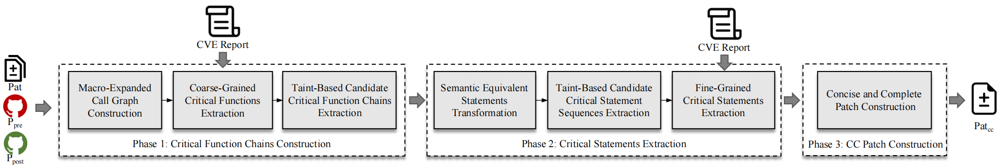

# Copalot
This folder contains the implementation of `Copalot`. The system is organized into three main phases, each playing a critical role in identifying critical changes in vulnerability patches.


## Dependencies

To run this project, you will need the following dependencies:

- **python**: 3.11.8

- **joern**: v4.0.250

  The installation process for Joern can be found at https://docs.joern.io/installation.

- **tree-sitter**: 0.22.6

  The installation process for tree-sitter can be found at https://tree-sitter.github.io/tree-sitter/

- **ctags:** 5.9.0
 
    The installation process for ctags can be found at https://github.com/universal-ctags/ctags.

- Other relevant dependent packages listed in [requirements.txt](./requirements.txt)

  To setup, just run:

  ```
  pip install -r requirements.txt
  ```

## How to Run
To run this tool, just modify the path of ctags `CTAGS_PATH`, the path of joern `joern_path`, the path of dataset `excel_path` and the api key of GPT-4O `LLM_KEY` in the lines 15-18 of the script `config.py` and run the script `main.py` in the following step:
```
    python main.py
```
The results will be shown in the directory `results_cache`.

## Phases
### 1. Phase 1: Critical Function Chains Construction (`function_clustering.py`, `cg_path.py`, `format_code.py`, `taint_analysis.py`)
This phase constructs the critical function chains. It utilizes gcc to extract macros, Joern for static code analysis to construct call graphs, LLM to identify the critical functions and also Joern to link other potential critical functions by inter-procedural taint analysis.

**Input:** Pre- & Post-patch project, original patch and CVE report

**Output:** critical function chains

### 2. Phase 2: Critical Statements Extraction (`code_transformation.py`, `merge_taint_path.py`, `taint_analysis.py`)
This phase extracts the critical statements. It utilizes Tree-sitter for semantic equivalent statements transformation, Joern to taint analysis and LLM to identify the critical statements

**Input:** critical function chains, original patch and CVE report

**Output:** critical statements

### 3. Phase 3: CC Patch Construction (`clang-tidy.py`, `recovery.py`)
This phase recovers the extracted macros and transformed code and generate the CC patch. It utilizes clang-tidy to ensure that the CC patches are applied correctly.

**Input:** critical statements, Pre- & Post-patch project and original patch

**Output:** CC patch
